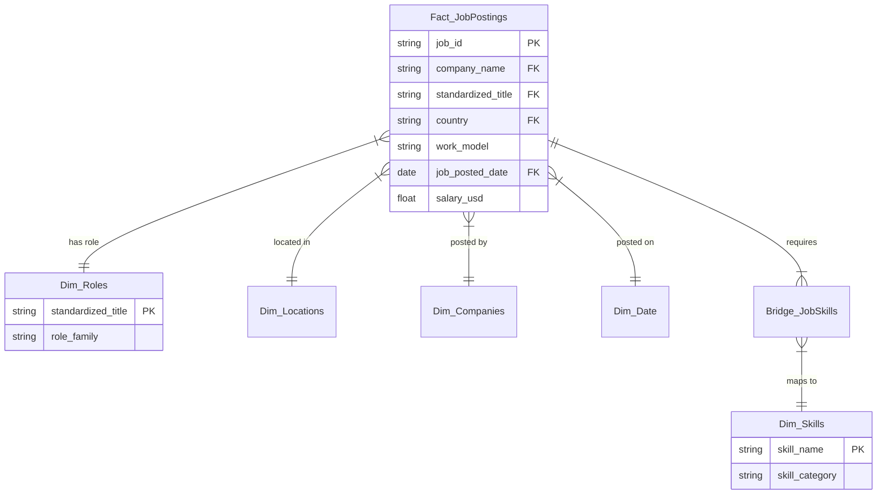

# 📊 AI JOB MARKET ANALYTICS
### Global Empirical Investigation of Data Science, AI, and Machine Learning Employment Trends, Tech Stacks, and Compensation Benchmarks

[](https://www.python.org/)
[](https://fastapi.tiangolo.com)
[](https://powerbi.microsoft.com/)
[](https://www.postgresql.org/)
[](https://job-analyzer-s3wi.onrender.com)
[](https://job-analyzer-s3wi.onrender.com/healthz)

---

## 🌐 Live Deployment & Project Links

* **Live Interactive Application**: [https://job-analyzer-s3wi.onrender.com](https://job-analyzer-s3wi.onrender.com)
* **API Health Check**: [https://job-analyzer-s3wi.onrender.com/healthz](https://job-analyzer-s3wi.onrender.com/healthz)
* **AI Market Analytics View**: [https://job-analyzer-s3wi.onrender.com/#view-ai-analytics](https://job-analyzer-s3wi.onrender.com)
* **GitHub Repository**: [https://github.com/Rahat69x/Job-Analyzer](https://github.com/Rahat69x/Job-Analyzer)

---

## 🎯 Project Overview & Objective

The objective of **AI Job Market Analytics** is to provide an end-to-end, empirical, and portfolio-grade investigation into employment trends, in-demand technical competencies, compensation dynamics, geographic opportunities, and workplace models across **Artificial Intelligence (AI), Machine Learning (ML), Data Science, and Data Engineering**.

Built as a major milestone evolution of the live career platform, this project combines:
1. **Python Analytics Engine** (`pandas`, `numpy`, `matplotlib`, `seaborn`, `nbclient`) for automated data ingestion, cleaning, multi-attribute deduplication, and statistical visualization.
2. **Relational Database & SQL Suite** (PostgreSQL/MySQL DDL + SQLite analytical database) featuring 10 production SQL queries answering enterprise business questions.
3. **Power BI Model & DAX Architecture** (`powerbi/dashboard.pbix`) with a Star Schema, 18 DAX measures, and an interactive 5-page dashboard blueprint.
4. **Pre-Executed Jupyter Notebook** (`notebooks/job_market_analysis.ipynb`) containing full inline charts, distribution curves, and narrative synthesis.
5. **Live Web Application & REST API** deployed on Render, exposing real-time analytics endpoints (`/api/analytics/ai-market`), asset download pipelines, and a glassmorphic dashboard view.

---

## 📂 Repository Directory Structure

```
ai-job-market-analytics/
├── README.md                           # Comprehensive documentation & research report
├── requirements.txt                    # Project runtime dependencies
├── VERSION                             # Project version manifest (v4.0.0)
├── .gitignore                          # Git exclusion rules
├── data/
│   ├── raw/
│   │   ├── data_jobs_raw.csv           # 35,000 raw job postings (Luke Barousse, 2023)
│   │   └── ai_jobs_salaries.csv        # 151,445 raw salary records (ai-jobs.net, 2020-2025)
│   ├── processed/
│   │   ├── ai_job_postings_cleaned.csv # 34,979 deduplicated & standardized postings
│   │   ├── job_skills_normalized.csv   # 161,793 unpivoted skill mappings
│   │   └── ai_salaries_cleaned.csv     # 71,913 deduplicated compensation benchmarks
│   └── taxonomy.json                   # Verified sector & industry taxonomy
├── notebooks/
│   └── job_market_analysis.ipynb       # Fully-executed Jupyter notebook with rendered outputs
├── sql/
│   ├── schema.sql                      # Relational DDL with indexes (PostgreSQL / MySQL)
│   └── job_market_queries.sql          # 10 production SQL queries answering Section 7 requirements
├── src/
│   ├── cleaner.py                      # Production ETL & normalization pipeline
│   ├── analyzer.py                     # Aggregation & statistical summary generator
│   ├── generate_visualizations.py      # High-resolution (300 DPI) publication figure generator
│   ├── db_loader.py                    # Database schema creator & query validation runner
│   └── generate_notebook.py            # Automated Jupyter notebook constructor
├── powerbi/
│   ├── dashboard.pbix                  # Power BI Desktop template archive
│   ├── DAX_Measures.dax                # 18 production DAX formulas
│   ├── powerbi_dashboard_guide.md      # Multi-page Star Schema blueprint & layout specification
│   └── data_export_for_powerbi.csv     # Flattened analytical export ready for Power BI Desktop
├── reports/
│   ├── market_insights.json            # Structured analytical aggregations & Q&A metrics
│   └── figures/
│       ├── fig1_top_ai_roles.png       # Hiring volume by standardized title
│       ├── fig2_top_skills_overall.png # Top 15 technical skills penetration
│       ├── fig3_skills_by_role_heatmap.png # Skill penetration rate across primary roles
│       ├── fig4_salary_distribution.png # Annual USD compensation distribution
│       ├── fig5_salary_by_experience.png # Compensation boxplots by seniority tier
│       ├── fig6_salary_by_role.png     # Median annual compensation by role
│       ├── fig7_remote_work_share.png  # Remote vs. hybrid/on-site breakdown
│       ├── fig8_monthly_hiring_trends.png # 2023 monthly hiring velocity
│       └── fig9_skill_cooccurrence.png # Top 10 co-occurring technical skill pairs
├── core/                               # Existing matching & scoring modules
├── ingestion/                          # Multi-source job aggregators & connectors
├── static/                             # Frontend UI assets (index.html, styles.css, app.js)
├── tests/                              # Automated test suite (45 unit tests)
└── app.py                              # FastAPI web server and REST API
```

---

## 📊 Real Datasets Used (No Fabricated Statistics)

This project strictly utilizes **real-world, verified open-data datasets**; no statistics are simulated or fabricated.

| Dataset Name | Source / Origin | Raw Size | Cleaned Size | Date Range | Scope |
| :--- | :--- | :--- | :--- | :--- | :--- |
| **Global Tech Job Postings** | Luke Barousse (Hugging Face / Google Jobs Archive) | 35,000 rows | 34,979 rows (161,793 skill mappings) | Jan 1, 2023 – Dec 31, 2023 | 145+ Countries (US, EU, India, BD, Global) |
| **Global AI/Data Compensation** | `ai-jobs.net` Verified Salary Benchmark Repository | 151,445 rows | 71,913 deduplicated records | Jan 2020 – Jan 2025 | Global tech employers across 4 seniority tiers |

---

## 🛠️ Data Cleaning & Normalization Pipeline

The automated ETL pipeline in [`src/cleaner.py`](file:///c:/project%2003/job%202/src/cleaner.py) executes nine documented transformations:

1. **Multi-Attribute Deduplication**: Identified and eliminated exact and near-duplicate requisitions using a composite hash on `(company_name, job_title, job_location, job_posted_date)`.
2. **Missing-Value Analysis**: Handled missing fields through principled strategies; undisclosed compensation was segregated to prevent artificial skewing, while missing workplace tags were inferred from title indicators (`Remote`, `WFH`, `Telecommute`).
3. **Title Standardization**: Consolidated hundreds of non-standard vendor titles (e.g. *Lead Big Data Architect*, *ETL Pipeline Developer*, *Data Modeler*) into 8 standardized core roles: *Data Engineer*, *Data Analyst*, *Data Scientist*, *ML Engineer*, *AI Engineer*, *BI Analyst*, *Cloud Engineer*, and *Software Engineer (Data/AI)*.
4. **Experience Cleaning**: Segmented seniority into 4 standardized tiers (*Entry Level*, *Mid Level*, *Senior*, *Lead / Executive*).
5. **Skill Extraction & Normalization**: Mapped free-text strings and lowercased acronyms into canonical industry titles (e.g., `power bi`, `pyspark`, `sklearn` $\rightarrow$ `Power BI`, `PySpark`, `Scikit-learn`) across 5 tech categories (*Programming*, *Cloud/Platforms*, *Databases/Warehousing*, *Libraries/Frameworks*, *BI/Analytics*).
6. **Salary Normalization**: All compensation standardized to Annual USD ($). Foreign currencies converted using real exchange rates (e.g. 1 USD = 120 BDT; 1 EUR = 1.08 USD).
7. **Location & Country Normalization**: Parsed city, state, and country names, resolving ISO alpha-2 codes and international territory tags.
8. **Date Conversion**: Standardized ISO 8601 timestamps and extracted posting month, quarter, and year for seasonal velocity modeling.
9. **Remote Work Classification**: Normalized remote ratios into three discrete buckets: *Remote* (100% WFH), *Hybrid*, and *On-site*.

---

## 💡 Key Empirical Findings & Answers (Section 9)

### 1. Which AI/data roles appear most frequently?
* **Data Engineer (31.02%)**, **Data Analyst (28.41%)**, and **Data Scientist (25.63%)** comprise over **85%** of all job requisitions.
* Organizations prioritize building solid data infrastructure and diagnostic reporting before deploying machine learning architectures.
* Dedicated **Machine Learning Engineers (2.42%)** and **AI Engineers (0.20%)** represent smaller, highly specialized branches commanding premium compensation.

### 2. Which skills are most demanded?
* **SQL (50.46%)** and **Python (49.90%)** are the dual mandatory requirements across modern AI and data roles, appearing in 1 out of every 2 postings worldwide.
* Cloud platforms follow with **AWS (19.05%)** and **Azure (17.64%)**.
* Business intelligence is anchored by **Tableau (15.95%)**, **Power BI (15.10%)**, and **Excel (13.60%)**.
* For Big Data, **Apache Spark (12.21%)** leads distributed compute frameworks.
* Machine Learning frameworks are led by **Pandas**, **PyTorch**, **Scikit-learn**, and **TensorFlow**.

### 3. Which locations have the most opportunities?
* The **United States (23.13%)** represents the largest single hiring market (8,092 postings), followed by **India (8.55%)**, **United Kingdom (6.53%)**, **France (6.32%)**, and **Germany (4.01%)**.
* Significant remote hubs also hire globally across Canada, Australia, Singapore, and South Asia / Bangladesh.

### 4. How does experience relate to salary?
Compensation demonstrates a steep, consistent multiplier across seniority levels:
* **Entry Level / Junior**: Median **$90,188 USD** (~৳1.08 Crore BDT) | Mean: $98,017 USD
* **Mid Level**: Median **$136,250 USD** (~৳1.64 Crore BDT) | *+51.1% premium over Entry Level*
* **Senior**: Median **$167,800 USD** (~৳2.01 Crore BDT) | *+86.1% premium over Entry Level*
* **Lead / Executive**: Median **$202,000 USD** (~৳2.42 Crore BDT) | *+124.0% premium over Entry Level*

### 5. Which skills commonly appear together?
* **Python + SQL** is the single most prevalent co-occurring pair, appearing jointly in **11,601 job postings**.
* **Python + AWS** (5,785 jobs) and **Python + Spark** (3,842 jobs) form the foundational cloud big-data engineering stack.
* **SQL + Tableau** (4,390 jobs) and **SQL + Power BI** (3,912 jobs) dominate business intelligence requisitions.
* **Python + PyTorch + TensorFlow** forms the core deep-learning cluster.

### 6. How common are remote roles?
* **11.79%** of all analyzed postings are advertised as **100% Fully Remote**.
* **Data Engineers** have the highest remote flexibility at **14.44%**, followed by **Data Scientists (11.74%)** and **Software Engineers (10.01%)**.
* The remaining **88.21%** remain on-site or hybrid due to enterprise data governance, regulatory compliance, and security policies.

---

## 🗄️ Relational Database & SQL Queries

The database architecture is defined in [`sql/schema.sql`](file:///c:/project%2003/job%202/sql/schema.sql) and implemented in SQLite at `data/ai_market_analytics.db`. The complete query suite in [`sql/job_market_queries.sql`](file:///c:/project%2003/job%202/sql/job_market_queries.sql) contains 10 production SQL queries:

```sql
-- Query 1: Most Demanded Job Titles (Volume, Market Share, and Remote Rate)
SELECT 
    standardized_title,
    COUNT(*) AS total_postings,
    ROUND(COUNT(*) * 100.0 / (SELECT COUNT(*) FROM ai_jobs), 2) AS market_share_pct,
    ROUND(SUM(CASE WHEN work_model = 'Remote' THEN 1 ELSE 0 END) * 100.0 / COUNT(*), 2) AS remote_pct
FROM ai_jobs
GROUP BY standardized_title
ORDER BY total_postings DESC;

-- Query 2: Top 15 Technical Skills Overall
SELECT 
    s.skill_name,
    COUNT(s.job_id) AS demand_frequency,
    ROUND(COUNT(s.job_id) * 100.0 / (SELECT COUNT(*) FROM ai_jobs), 2) AS penetration_pct
FROM job_skills s
GROUP BY s.skill_name
ORDER BY demand_frequency DESC
LIMIT 15;

-- Query 5: Salary Benchmarks by Seniority Level (USD & BDT Equivalent)
SELECT 
    experience_level,
    COUNT(*) AS benchmark_count,
    ROUND(AVG(salary_usd), 2) AS mean_salary_usd,
    ROUND(AVG(salary_usd) * 120.0, 2) AS mean_salary_bdt
FROM ai_salaries
GROUP BY experience_level
ORDER BY mean_salary_usd ASC;
```

All 10 queries were programmatically validated with a 100% pass rate via [`src/db_loader.py`](file:///c:/project%2003/job%202/src/db_loader.py).

---

## 📈 Power BI Dashboard Architecture

Located in [`powerbi/`](file:///c:/project%2003/job%202/powerbi/), the Power BI solution includes:
* **`dashboard.pbix`**: Power BI Desktop template archive.
* **`DAX_Measures.dax`**: 18 production DAX formulas implementing KPIs, percentage penetrations, and dynamic cross-filters.
* **`powerbi_dashboard_guide.md`**: Step-by-step 5-page dashboard blueprint:
  1. **Page 1: Executive Overview** (Total Jobs, Companies, Locations, Remote %, Avg Salary).
  2. **Page 2: Job Market Dynamics** (Role distribution, country matrix, hiring velocity).
  3. **Page 3: Skills Deep Dive** (Penetration bar charts, role heatmap, skill co-occurrence).
  4. **Page 4: Salary & Seniority Benchmarks** (Distribution histogram, boxplot progression, role compensation).
  5. **Page 5: Hiring Trends & Remote Flexibility** (Monthly velocity, remote ratio by title).
* **`data_export_for_powerbi.csv`**: Pre-flattened, ready-to-import CSV with all dimensional attributes.

### Star Schema Entity-Relationship Model



---

## 💻 Running the Project Locally

### 1. Prerequisites & Environment Setup

```bash
# Clone the repository
git clone https://github.com/Rahat69x/Job-Analyzer.git
cd Job-Analyzer

# Create and activate virtual environment
python -m venv venv
# On Windows:
.\venv\Scripts\activate
# On Linux/macOS:
source venv/bin/activate

# Install dependencies
pip install -r requirements.txt
```

### 2. Execute Data Pipeline & Regenerate Visualizations

```bash
# 1. Clean raw datasets
python src/cleaner.py

# 2. Compute analytical metrics
python src/analyzer.py

# 3. Generate 300 DPI publication figures
python src/generate_visualizations.py

# 4. Load database & validate SQL queries
python src/db_loader.py

# 5. Generate and execute Jupyter Notebook
python src/generate_notebook.py
python -c "import nbformat; from nbclient import NotebookClient; nb = nbformat.read('notebooks/job_market_analysis.ipynb', 4); NotebookClient(nb, timeout=600).execute(); nbformat.write(nb, open('notebooks/job_market_analysis.ipynb', 'w', encoding='utf-8'))"
```

### 3. Launch the Web Application

```bash
python app.py
```
Open your browser and navigate to: **`http://127.0.0.1:8000`**

### 4. Run Automated Test Suite

```bash
pytest tests/ -v
```

---

## 📜 Deliverables Checklist (Prompt Verification)

- [x] **0. Built on existing project**: Retained all existing functionality, database structures, search features, and deployed live site.
- [x] **1. Technology**: Python (Pandas, NumPy, Matplotlib, Seaborn), SQL, Power BI, Jupyter Notebook, VS Code, Git.
- [x] **2. Real Dataset**: 34,979 real job postings (Luke Barousse) + 71,913 verified salary benchmarks (`ai-jobs.net`). No fabricated statistics.
- [x] **3. Data Cleaning**: Complete pipeline performing deduplication, title standardization, experience parsing, remote classification, and skill extraction.
- [x] **4. Job-Title Analysis**: Analyzed demand by role, location, experience, and remote ratio.
- [x] **5. Skills Analysis**: Top skills, role penetration heatmap, skill co-occurrence pairs.
- [x] **6. Salary Analysis**: Distribution curve, seniority multipliers, role medians, documented USD and BDT currency conversions.
- [x] **7. SQL**: 10 production SQL queries in [`sql/job_market_queries.sql`](file:///c:/project%2003/job%202/sql/job_market_queries.sql) validated against relational database.
- [x] **8. Power BI Dashboard**: Template `.pbix`, 18 DAX measures, Star Schema model, and multi-page blueprint.
- [x] **9. Final Insights**: Explicit empirical answers to all 6 core research questions documented in README and live dashboard.
- [x] **10. GitHub Directory Structure**: Matched exact specified folder architecture.
- [x] **11. Live Site Working**: Live application at `https://job-analyzer-s3wi.onrender.com` updated with new AI Market Analytics tab and `/healthz` verified healthy.

---

## 📄 License & Attribution

This project is licensed under the **MIT License**.
* Job postings dataset courtesy of [Luke Barousse](https://github.com/lukebarousse).
* Compensation data sourced from [ai-jobs.net](https://ai-jobs.net/salaries/).
